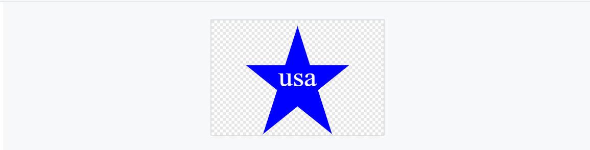
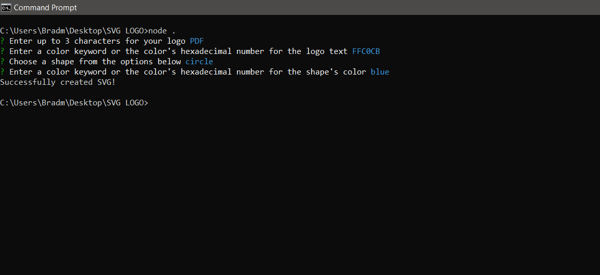
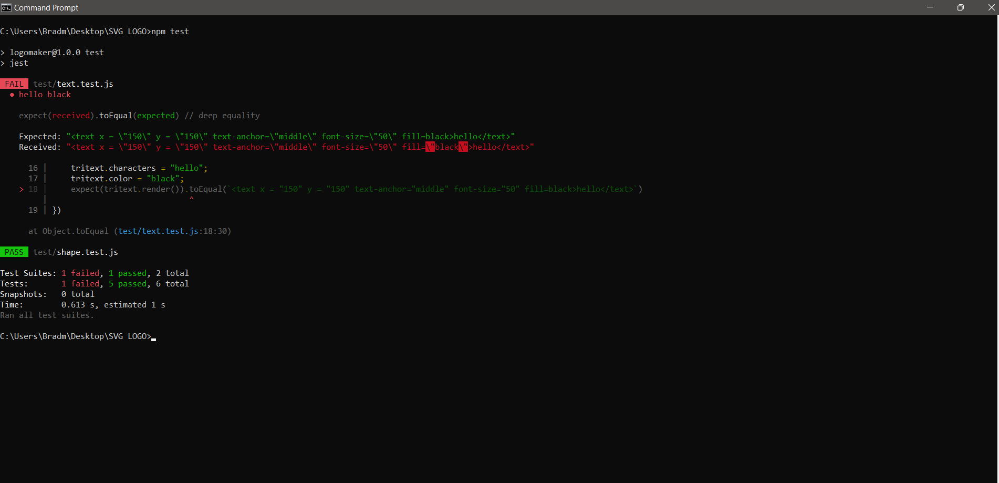
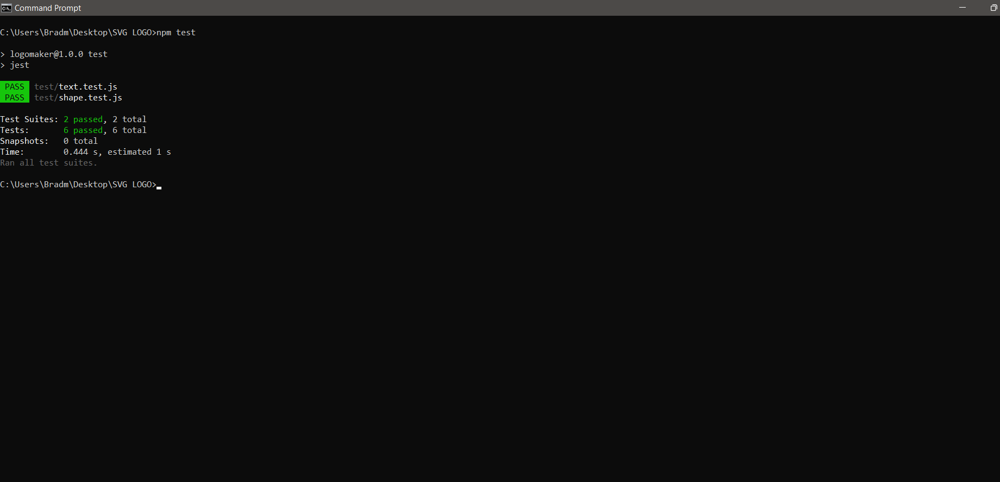
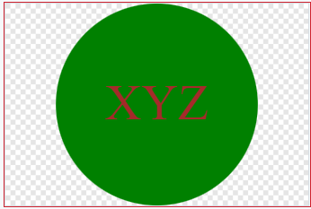
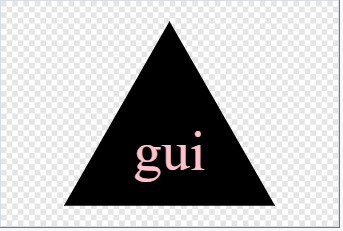
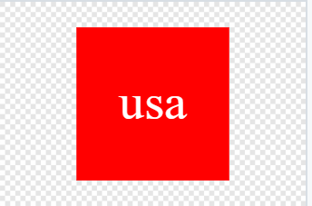
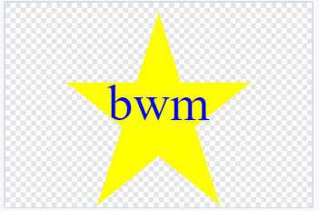

# How Low Can You Logo Creator  

  by Walter Moleterno     

## Description 

This application produces a simple logo which consists of a three-letter logo centered in a geometric shape. The user has the choice of four shapes, a circle, a triangle, a square or a star. The user also inputs the three letters that they would like to incorporate into the logo. Finally, the user chooses the colors for the letters and the shape. The user can enter the color choice as a color keyword or a hexadecimal number. Once the user completes their choices, the application saves the image as an SVG file. 

## Deployed Application URL 

This application is rendered via the command line.  Therefore, it can't be deployed from a URL.   

The video of the running application will be provided to demonstrate how this application works. To view the video, click here: [Video](https://watch.screencastify.com/v/7IBmHgINiFxD86neVPax) 

The Logo.SVG file created in the video was placed in the example folder. 

 

## Table of Contents 

* [Installation](#installation) 

* [How to Use This Application](#how-to-use-this-application) 

* [Licenses](#Licenses) 

* [Contributors](#contributors) 

* [Testing](#testing) 

* [Features](#features) 

* [Languages and Technologies Used](#languages-and-technologies-used) 

* [Dependencies](#dependencies) 

* [Questions](#questions) 

  

## Installation 

Clone the repository, How-Low-Can-You-LOGO-Creator. Bring up the command line. Navigate to the proper directory. Type "npm install". Once the installation has finished, type "npm test” to test the application via the jest npm package. Assuming the test yields a passed result, the application will run by typing “node  .” at the command line. 

## How to Use This Application: 

The application requires the user to interface at the command line.  Once the application starts, the logo is defined when the user answers the questions presented. A SVG file is produced and placed into the parent directory. This file can be incorporated into any acceptable medium. 

  

  

## Licenses 

 

MIT License

Copyright (c) 2023 Walter Moleterno

Permission is hereby granted, free of charge, to any person obtaining a copy
of this software and associated documentation files (the "Software"), to deal
in the Software without restriction, including without limitation the rights
to use, copy, modify, merge, publish, distribute, sublicense, and/or sell
copies of the Software, and to permit persons to whom the Software is
furnished to do so, subject to the following conditions:

The above copyright notice and this permission notice shall be included in all
copies or substantial portions of the Software.

THE SOFTWARE IS PROVIDED "AS IS", WITHOUT WARRANTY OF ANY KIND, EXPRESS OR
IMPLIED, INCLUDING BUT NOT LIMITED TO THE WARRANTIES OF MERCHANTABILITY,
FITNESS FOR A PARTICULAR PURPOSE AND NONINFRINGEMENT. IN NO EVENT SHALL THE
AUTHORS OR COPYRIGHT HOLDERS BE LIABLE FOR ANY CLAIM, DAMAGES OR OTHER
LIABILITY, WHETHER IN AN ACTION OF CONTRACT, TORT OR OTHERWISE, ARISING FROM,
OUT OF OR IN CONNECTION WITH THE SOFTWARE OR THE USE OR OTHER DEALINGS IN THE
SOFTWARE.

## Contributors 

N/A 

## Testing 

The application employes unit testing using the jest npm package. Development of the application followed the test driven development (TDD) paradigm in which test are developed before the code is actually written. The errors that ensue are used to design the eventual code. The test can be run by typing “npm test” at the command line. If the code is faulty, an error message will detail the problem.

 

 Passing test are displayed in green. 

 

## Features 

The application has three required shapes: 

A circle: 

 

A triangle: 

 

 A square: 

 

The user can pick a variety of colors 

In addition to the three shapes assigned, a fourth shape, a star, was also included. 

 

## Languages and Technologies Used 

 

 

## Dependencies 

Inquirer version 6.3.1 and Jest version 29.6.2 as a devDependency 

 

## Questions 

Please send your questions by email:  Bradm1492@gmail.com or visit [github/Boilermaker74](https://github.com/Boilermaker74). 
